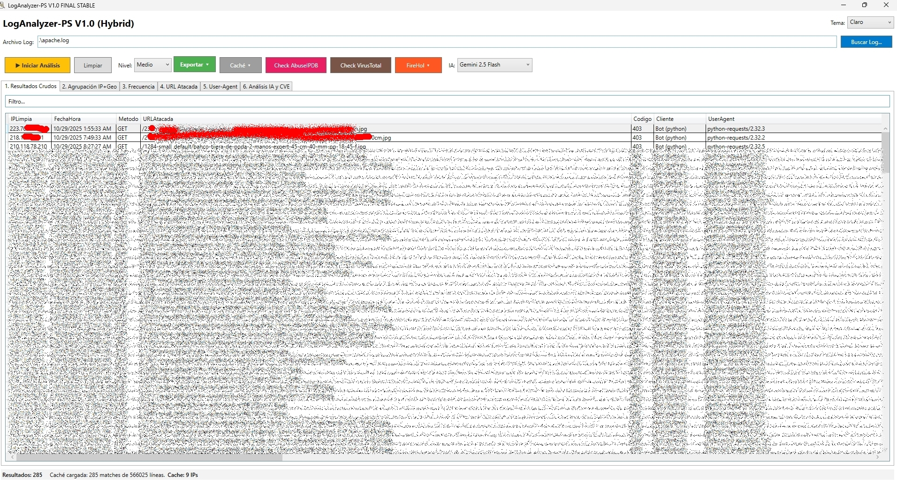
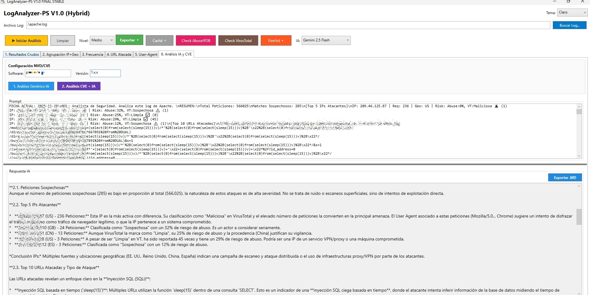
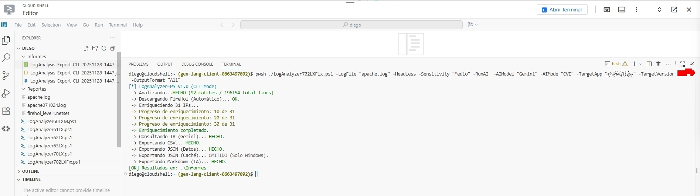

# 🚀 LogAnalyzer-PS: Analizador Forense de Logs Web Híbrido Avanzado


-success)


**Versión: 1.0.0 FINAL STABLE (Madurez Interna: V7.0)**
**Autor:** Diego García Merino
**Plataformas:** Windows (GUI/CLI) | Linux/macOS (CLI)

---

## 👁️ Visión General

**LogAnalyzer-PS** es una herramienta de ciberinteligencia y análisis forense de alto rendimiento desarrollada en **PowerShell**.

Está diseñada para procesar, filtrar y enriquecer logs de **cualquier servidor web** que utilice formatos estándar (Common Log Format, Extended Log Format), incluyendo **Apache, Nginx, IIS, Cloudflare**, etc.

Esta es la **versión inaugural pública (v1.0.0)**, lanzada tras una exhaustiva fase de desarrollo y estabilización interna. Su característica principal es su **Modo Híbrido**, que permite:
1.  **Análisis Interactivo:** Usando una Interfaz Gráfica (WPF) en entornos Windows.
2.  **Automatización:** Ejecutándose en **Línea de Comandos (CLI)** en servidores Linux/macOS.
## 🖼️ Interfaces y Ejemplos de Uso

**LogAnalyzer-PS** ofrece una experiencia de análisis dual: una potente Interfaz Gráfica de Usuario (GUI) en Windows y un modo de Línea de Comandos (CLI) optimizado para entornos Linux/macOS.

### Interfaz Gráfica de Usuario (Windows)

La GUI de WPF simplifica la configuración de parámetros complejos y ofrece una vista tabular interactiva para el análisis forense de logs.



*Vista del proceso de análisis y el panel de configuración de parámetros avanzados.*



### Modo de Línea de Comandos (Linux/Cloud)

El modo CLI permite la automatización y el uso eficiente en máquinas virtuales o servidores en la nube, optimizado para el rendimiento.



### ⚠️ Recomendación de Tamaño del Log

Debido a que el script procesa y carga cada línea del log en memoria como un objeto de PowerShell, recomendamos analizar logs de hasta **1 GB a 2 GB** en un solo proceso. Para archivos más grandes, se sugiere dividirlos previamente para garantizar un rendimiento óptimo y evitar la sobrecarga de memoria del sistema.

### ✨ Características Destacadas (v1.0.0)

| Característica | Descripción |
| :--- | :--- |
| **Modo Híbrido CLI/GUI** | Un solo script funciona en **Windows (WPF)** y en **Linux/macOS (CLI)**, garantizando la estabilidad en ambos entornos. |
| **Análisis Multi-IA** | Integración nativa con **Gemini** (Google), **GPT-4o** (OpenAI) y Modelos Locales (vía Ollama). |
| **Inteligencia CVE Contextual** | Correlación automática de ataques con NVD/NIST para identificar el exploit. |
| **Threat Intelligence (TI)** | Verificación en tiempo real de IPs con **Ipinfo.io**, **AbuseIPDB**, **VirusTotal** , **FireHol**,  |
| **Estabilidad Robusta** | Versión estable que incluye correcciones críticas de estabilidad y gestión de errores de entrada del usuario. |
| **Reportes Avanzados** | Exportación asíncrona a **Excel**, **CSV**, **JSON** y generación de informes de IA en formato **Markdown (.md)**. |


---

## ⚙️ Requisitos y Configuración

### Requisitos de Plataforma

| Plataforma | Requisito Principal | Notas |
| :--- | :--- | :--- |
| **Windows** | PowerShell 5.1 o superior. | Necesario para la GUI (WPF). |
| **Linux/macOS** | PowerShell Core (`pwsh`). | Necesario para el modo CLI (`-Headless`). |

### Archivos y Dependencias Auxiliares

| Fichero | Propósito | Notas |
| :--- | :--- | :--- |
| `patterns.json` | Contiene las expresiones regulares (Regex) para la detección de ataques. | Opcional, el script usa patrones por defecto si no se encuentra. |
| `Cache_Analysis_[Fecha].json` | Almacena los resultados de las consultas a APIs. | **CRÍTICO** para optimizar el uso de cuotas de API. |
| `firehol_level1.netset` | Lista de bloqueo de IPs de FireHol. | **Se descarga automáticamente** la primera vez que se ejecuta el script. |
### Contribuciones de Threat Intelligence

El script mejora su capacidad de detección de bots maliciosos mediante la descarga dinámica de una lista negra de User-Agents.

| Recurso | Propósito | Atribución |
| :--- | :--- | :--- |
| **Lista de User-Agents Maliciosos** | Identificación de bots, crawlers y herramientas de *scrapping* activos. | Mantenida por el proyecto con **Licencia MIT** [apache-ultimate-bad-bot-blocker](https://github.com/mitchellkrogza) de **Mitchell Krogza**. |

### Configuración de API Keys

Es **obligatorio** configurar las siguientes variables al inicio del script:

| API Key | Uso | Variable a Editar |
| :--- | :--- | :--- |
| **[Gemini](https://aistudio.google.com) / [GPT](https://openai.com/es-ES/index/openai-api/)** | Análisis y contextualización de logs. | `$GeminiApiKey` o `$OpenAIApiKey` |
| **[AbuseIPDB](https://www.abuseipdb.com)** | Reputación de IPs y Score de Abuso. | `$AbuseApiKey` |
| **[VirusTotal](https://www.virustotal.com/gui/my-apikey/)** | Análisis de URLs y IPs sospechosas. | `$VirusTotalApiKey` |

---

## 🚀 Modo de Uso en Línea de Comandos (CLI)

El modo CLI se activa mediante el *switch* **`-Headless`** y requiere la especificación de `-LogFile`.
## 💻 Parámetros de Línea de Comandos (CLI)

Los siguientes parámetros son obligatorios o clave para ejecutar el script en modo **Headless** (`-Headless` debe estar presente).

| Parámetro | Tipo | Obligatorio | Descripción | Valores Válidos | Por Defecto |
| :--- | :--- | :--- | :--- | :--- | :--- |
| **`-LogFile`** | String | Sí | **Ruta completa al archivo de log** (`access.log`, `nginx.log`, etc.) a analizar. | Ruta válida del archivo. | *Ninguno* |
| **`-Headless`** | Switch | Sí | **Activa el modo CLI** (sin Interfaz Gráfica). Necesario en Linux/macOS. | (Switch) | *Desactivado* |
| **`-RunAI`** | Switch | No | Si está presente, ejecuta automáticamente el análisis de IA al finalizar el *parsing* del log. | (Switch) | *Desactivado* |
| **`-AIModel`** | String | No | Selecciona el modelo de IA a utilizar. Requiere claves API configuradas. | `Gemini`, `GPT`, `Ollama` | `Gemini` |
| **`-AIMode`** | String | No | Define el tipo de análisis que realizará la IA. | `General`, `CVE` | `General` |
| **`-OutputFormat`** | String | No | Formato de exportación del reporte de resultados y *matches*. | `CSV`, `JSON`, `Excel`, `Markdown`, `All` | `CSV` |
| **`-TargetApp`** | String | Condicional | **(Requerido para `-AIMode CVE`)** Nombre del software objetivo de la aplicación web (ej. `wordpress`). | Nombre del software. | `""* |
| **`-TargetVersion`** | String | Condicional | **(Requerido para `-AIMode CVE`)** Versión específica del software (ej. `6.4.2`). | Número de versión. | `""* |
| **`-Sensitivity`** | String | No | Define el umbral de filtrado para los resultados. | `Bajo`, `Medio`, `Alto` | `Medio` 
|**`-OutputDir`** | String	 |No |	Ruta de la carpeta donde se guardarán los reportes de salida (CSV, JSON, Markdown).	|Ruta válida de directorio. |	Directorio del script |
### 1. Ejemplo en Windows (PowerShell)

```powershell
# Análisis completo, uso de Gemini y reporte Markdown
.\LogAnalyzer-PS.ps1 `
  -LogFile "C:\logs\access_web.log" `
  -Headless `
  -RunAI `
  -AIModel "Gemini" `
  -OutputFormat "Markdown" 
  -OutputDir "C:\Informes"
````

### 2\. Ejemplo en Linux / macOS (PowerShell Core - `pwsh`)

```bash
# Análisis básico con exportación CSV para servidor Nginx
pwsh ./LogAnalyzer-PS.ps1 \
  -LogFile "/var/log/nginx/access.log" \
  -Headless \
  -OutputFormat "CSV"
```

### 3\. Ejemplo CVE Específico

Análisis del log para un ataque dirigido a un software específico (ej. **PrestaShop 1.7.5**).

```powershell
.\LogAnalyzer-PS.ps1 `
  -LogFile ".\logs\prestashop_attack.log" `
  -Headless `
  -RunAI `
  -AIMode "CVE" `
  -TargetApp "prestashop" `
  -TargetVersion "1.7.5" `
  -Sensitivity "Alto" `
  -OutputFormat "CSV"
```

-----

## ⚖️ Licencia y Responsabilidad

### Licencia

Este proyecto se distribuye bajo la licencia **Business Source License 1.1 (BSL 1.1)**.

El código fuente está disponible para estudio, uso personal, educativo y de auditoría. Se requiere el reconocimiento al autor (**Diego García Merino**) en todos los casos.

**BSL 1.1 y Transición a OSS**
Esta licencia está configurada con una Fecha de Cambio de **3 años** desde Noviembre de 2025. Después de este período, el código fuente pasará automáticamente a ser **Open Source** bajo la licencia [Licencia OSS de Destino - Ej. Apache 2.0 o MIT], salvo modificación en contra por parte del autor.

### ⚠️ Descargo de Responsabilidad (Disclaimer)

**El software se entrega "tal cual" (as is), sin garantías de ningún tipo, expresas o implícitas.**
**Probado en Windows, Linux y ficheros log de Apache, con IA de Gemini**

En ningún caso los autores o los titulares de los derechos de autor serán responsables de reclamaciones, daños u otras responsabilidades que surjan del uso del software.

**Aviso Importante sobre APIs:**
**La adquisición y el uso de las claves de API de terceros y los Servicios de Inteligencia Artificial (Gemini, GPT, AbuseIPDB, VirusTotal) son responsabilidad exclusiva del usuario.** El usuario es el único responsable del cumplimiento de los términos de servicio, las políticas de uso y los costos asociados de dichos proveedores. El uso de este software es bajo el propio riesgo del usuario.


